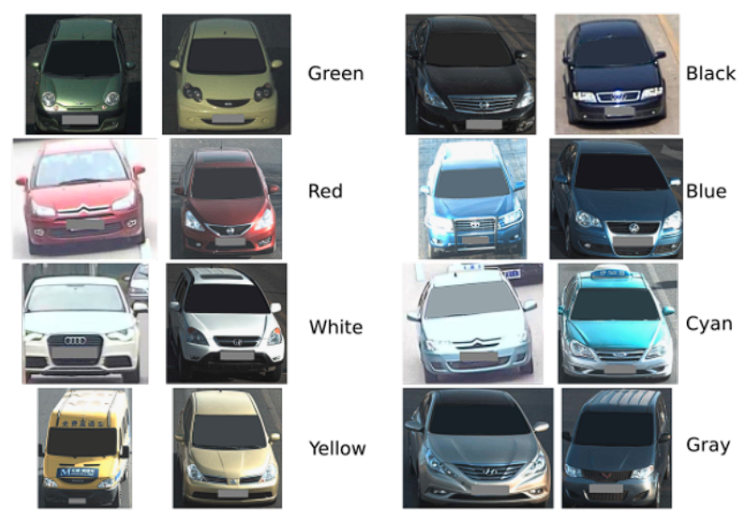
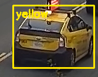
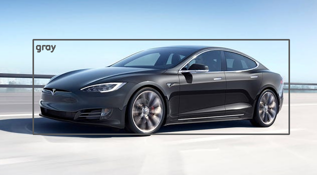

# Car color recognition

This project is a tool that detects a car's dominant color from one of these classes:



## Features

- model training
- grid search for hyperparameters optimisation
- semantic segmentation
- car color recognition from:
  - images
  - videos
  - live cam capture

## Used technologies


- `python`
  - numpy
  - scipy
  - tensorflow
  - pandas
  - opencv
  - scikit-learn
  - the [YOLO](https://pjreddie.com/darknet/yolo/) models
- `c`
  - the [darknet](https://pjreddie.com/darknet/) model

## Install and run

Supported Python versions:

- 3.8.X

Install neede dependencies:

```sh
    pip install -r requirements.txt
```

Download the needed weights and models:

- `YOLOv3` model weights from [this list](https://pjreddie.com/darknet/yolo/), preferably [this link](https://pjreddie.com/media/files/yolov3.weights)
- `Semantic segmentation` pretrained model from [this link](https://github.com/ayoolaolafenwa/PixelLib/releases/download/0.2.0/pointrend_resnet50.pkl)

## Example output

### Image




### Video


